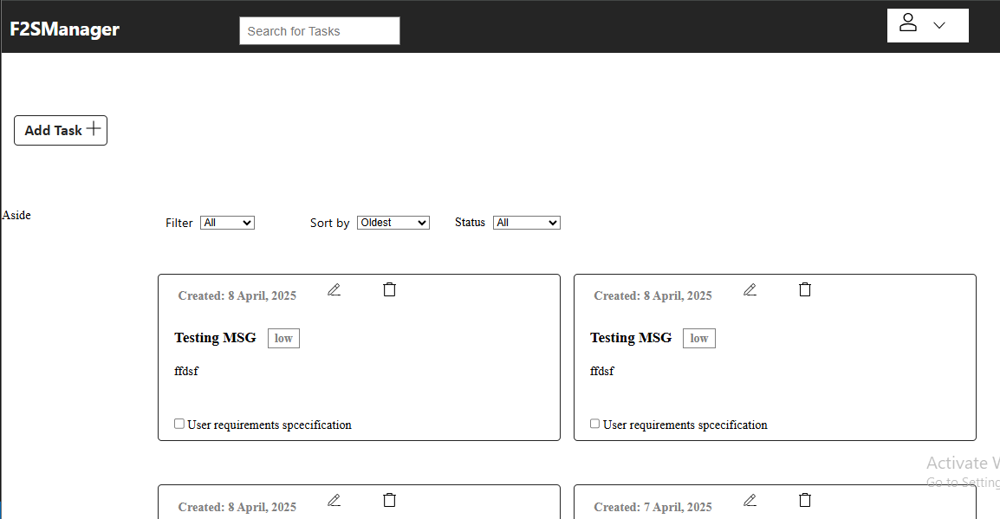
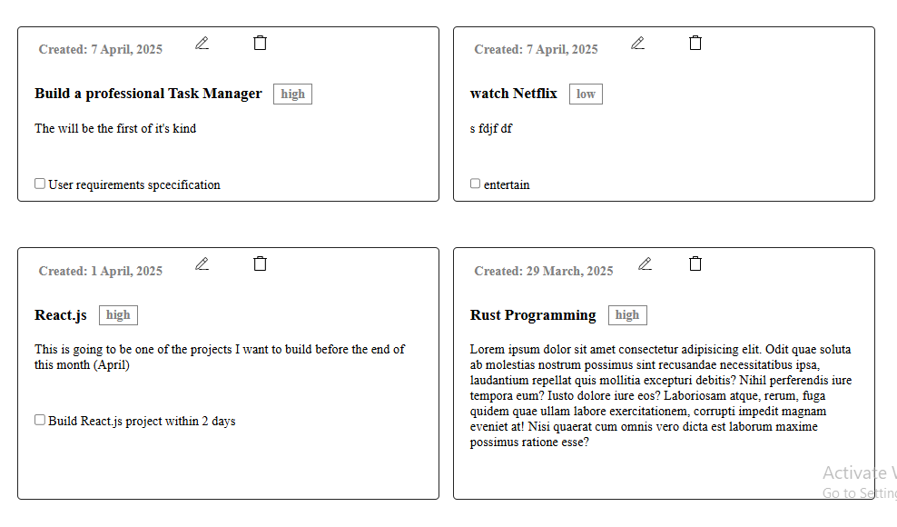
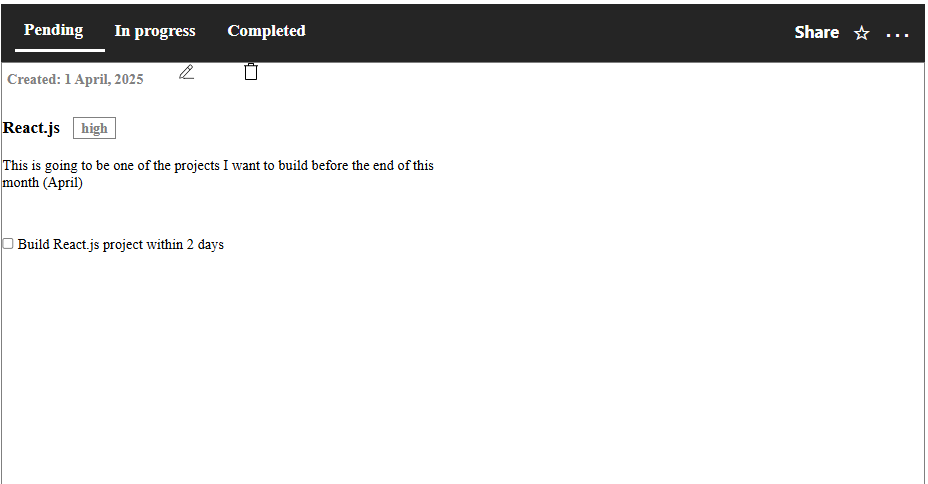

# F2SManager

**F2SManager** (FasFound Software Manager) is a powerful yet simple Django-based productivity app that helps users manage their daily tasks with features like filtering, sorting, and deadline tracking.









## 🚀 Features

- ✅ Create, edit, and delete tasks
- 📌 Set task priority: Low, Medium, High
- 📆 Add start and end dates
- 🔄 Filter by priority and status (Pending, Completed)
- 🧭 Sort by created date, start date, or end date
- 📱 Responsive UI with sidebar and grid layout
- 🔔 Planned: Email reminders & deadline alerts


## 🏗️ Tech Stack

- **Backend:** Django
- **Frontend:** HTML, CSS, JavaScript
- **Database:** SQLite (default)
- **Upcoming:** Celery + Redis (for background task reminders)


## 🛠️ Installation

### 1. Clone the repo:
```py
git clone https://github.com/yourusername/F2SManager.git
cd F2SManager
```

### 2. Create a virtual environment and install dependencies:

```py
python -m venv venv
source venv/bin/activate  # On Windows: venv\Scripts\activate
pip install -r requirements.txt

```

### 3. Run migrations and start the server:
```py
python manage.py migrate
python manage.py runserver
```

### 4. Visit http://localhost:8000/ to view the app!


## *This project is still evolving. Contributions and ideas are always welcome!*
